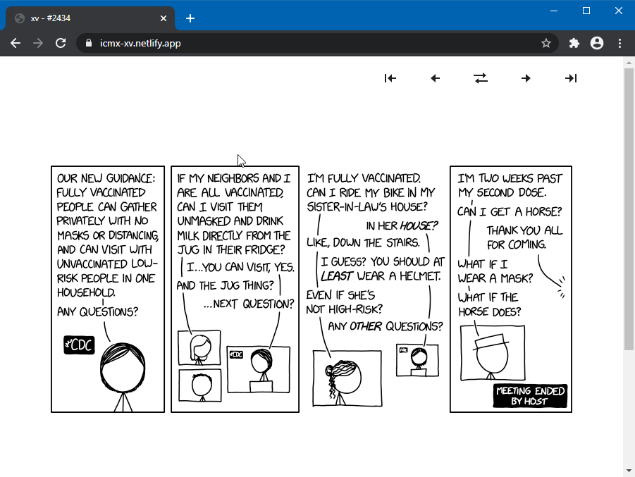

# xv [](https://icmx-xv.netlify.app/)

Simple xkcd comics viwer, done in pure JavaScript, CSS and Webpack.

Check it on **[icmx-xv.netlify.app](https://icmx-xv.netlify.app/)**!

## Features

  - Pure modern JavaScript and CSS, no frameworks or external dependencies used
  - Classic navigation experience as in original site (Random button included)
  - Keyboard navigation: use arrow keys, hold <kbd>Shift</kbd> for first/last, <kbd>R</kbd> for random
  - Routing: try [/#303](https://icmx-xv.netlify.app/#303) e.g.
  - Transcript for ~1600 first comics, with [parsing](src/lib/xkcdparse)!
  - Mobile-first and desktop layouts
  - Light and Dark modes without flashing on refresh — works with images too!

## How it looks like?



## Development

```sh
# clone repository
git clone https://github.com/icmx/xv

# go to local copy
cd xv

# install dependencies
npm install

# launch it on localhost:8000
npm run serve

# build it
npm run build
```

## License

[MIT](LICENSE).

Original comics are made by Randall Munroe at [xkcd.com](https://xkcd.com/).

Awesome icons set made by Atisa at [boxicons.com](https://boxicons.com/).
